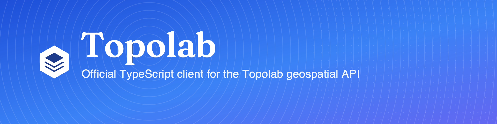

<p align="center">
  
</p>

<p align="center">
  <a href="https://www.npmjs.com/package/@topolab/sdk"></a>
  <a href="https://www.npmjs.com/package/@topolab/sdk"></a>
  <a href="https://github.com/topolab-bv/topolab-js/actions/workflows/ci.yml"></a>
  <a href="LICENSE"></a>
  <a href="https://docs.topolab.nl"></a>
</p>

<h1 align="center">@topolab/sdk</h1>

<p align="center">
  The official <b>TypeScript</b> client for the <a href="https://topolab.nl">Topolab</a> dataset and geospatial API.<br>
  Lightweight, GeoJSON-first, runs in Node and the browser.
</p>

---

📖 **Docs:** [topolab-bv.github.io/topolab-js](https://topolab-bv.github.io/topolab-js/) · full platform docs at [docs.topolab.nl](https://docs.topolab.nl)

## Install

```bash
npm install @topolab/sdk
```

> **Pre-release:** until the first version is published to npm, install from Git:
> `npm install github:topolab-bv/topolab-js`

Ships ES modules + CommonJS and TypeScript types. Uses the platform `fetch`, so
Node 18+ or any modern browser / edge runtime works with no polyfill.

## Quickstart

```ts
// Page Domino's locations within an Amsterdam bounding box
import { Client } from "@topolab/sdk";

const tl = new Client({ apiKey: "tlb_prod_..." });
const fc = await tl.dataset("nl-domino-poi").items({ limit: 100, bbox: [4.7, 52.2, 5.1, 52.5] });
console.log(`${fc.features.length} locations`);
```

Your API key carries your scope and add-ons — spatial queries need `GIS_ACCESS`,
downloads need `API_ACCESS`, and data routes require an organization-scoped key.
Pass `apiKey` or set `TOPOLAB_API_KEY` (avoid embedding keys in client bundles):

```ts
const tl = new Client({ apiKey: process.env.TOPOLAB_API_KEY });
```

## Staging vs production

The client targets **production** (`https://api.topolab.nl`) by default. Point it
at staging with the `environment` option:

```ts
const tl = new Client({ apiKey: "tlb_staging_...", environment: "staging" }); // https://api-staging.topolab.nl
```

Or set `TOPOLAB_ENV=staging`. An explicit `baseUrl` always wins (self-hosting /
tests). Precedence: `baseUrl` → `environment` → `TOPOLAB_BASE_URL` →
`TOPOLAB_ENV` → production.

## Pull everything you own

The loop this SDK is built for — discover what your organization licences, then
pull each dataset's newest snapshot. No hard-coded slugs:

```ts
import { Client } from "@topolab/sdk";
import { downloadArchive } from "@topolab/sdk/node";

const tl = new Client();

for await (const ds of tl.datasets.iterOwned()) {
  await downloadArchive(tl.dataset(ds.table), `${ds.table}.zip`, { month: "latest", format: "geojson" });
}
```

`iterOwned()` is filtered by the same licence check the download routes enforce,
so everything it yields is downloadable.

## What you can do

### Browse the catalog

```ts
const page = await tl.datasets.list({ country: "NL", limit: 10 });
```

### Query features in an area (spatial, paged)

```ts
const fc = await tl.dataset("nl-domino-poi").items({ limit: 100, bbox: [4.7, 52.2, 5.1, 52.5] });

// or stream every feature, paging transparently:
for await (const feature of tl.dataset("nl-domino-poi").iterItems({ pageSize: 500 })) {
  // ...
}
```

The async iterator cancels the in-flight request if you `break` early.

### Pull a whole dataset (bulk)

```ts
const fc = await tl.dataset("nl-domino-poi").toGeoJSON();   // FeatureCollection
```

### Stream a dataset to disk (Node only)

```ts
import { Client } from "@topolab/sdk";
import { download } from "@topolab/sdk/node";

const tl = new Client();
await download(tl.dataset("nl-domino-poi"), "dominos-nl.geojson", { format: "geojson" });
```

`download` lives in the `@topolab/sdk/node` subpath because it writes to the
filesystem — the core entry point stays browser-safe. `downloadArchive` lives
there for the same reason.

### List what you licence

```ts
const page = await tl.datasets.owned({ limit: 50 });   // page.total = all licensed datasets
for await (const ds of tl.datasets.iterOwned()) { /* every one, paged for you */ }
```

### Monthly archives

```ts
const ds = tl.dataset("business_professional_services_autocrew");
const months = await ds.archives();                    // newest first; free, no credits

import { downloadArchive } from "@topolab/sdk/node";
await downloadArchive(ds, "autocrew.zip", { month: "2026-07", format: "geojson" });
```

`month` is `"latest"`, `"YYYY-MM"` or `"YYYY-MM-DD"`, validated as a real
calendar value before the request goes out. Team plans see a trailing 12 months;
Enterprise sees everything.

### Coordinates with attributes

```ts
const page = await ds.coordinates({ limit: 1000 });
page.total;             // from X-Total-Count — the whole dataset, regardless of paging
page.rows[0].latitude;  // "51.49638600" — a decimal string, kept as one
```

### SQL across the datasets you licence (Enterprise)

```ts
const res = await tl.sql("SELECT city, count(*) AS n FROM autocrew GROUP BY 1", { maxRows: 100 });
```

One read-only `SELECT`, restricted to datasets you hold an active licence for.
Requires the `sql-access` entitlement, part of the Enterprise plan.

## Errors

Every failure throws a subclass of `TopolabError`, so you never parse raw JSON:

| Error | When |
|---|---|
| `AuthenticationError` | missing or invalid API key (401) |
| `AddonRequiredError` | key lacks the add-on — `.addon` names it (403) |
| `AccessDeniedError` | dataset not accessible to your organization (403) |
| `InsufficientCreditsError` | not enough credits — `.required` / `.available` (402) |
| `NotFoundError` | unknown dataset, or no archive available for that month (404) |
| `QueryTimeoutError` | a SQL query exceeded the server statement timeout (408) |
| `RateLimitError` | rate limited — `.retryAfter`, retried automatically (429) |

```ts
import { Client, AddonRequiredError } from "@topolab/sdk";

try {
  await tl.dataset("nl-domino-poi").toGeoJSON();
} catch (e) {
  if (e instanceof AddonRequiredError) console.log("Your key needs:", e.addon);
}
```

## Documentation

- **Full docs:** [docs.topolab.nl](https://docs.topolab.nl)
- The bulk vs. spatial access patterns, credits, and add-ons are described in the
  [SDK conventions](https://docs.topolab.nl) and the
  [`topolab-sdk-spec`](../topolab-sdk-spec) repository.
- A runnable example lives in [`examples/quickstart.ts`](examples/quickstart.ts).

## Contributing

Issues and pull requests are welcome. See [`CONTRIBUTING.md`](CONTRIBUTING.md).
Run `npm test`, type-check with `npm run typecheck`, build with `npm run build`.

## License

[MIT](LICENSE) © Topolab B.V.
